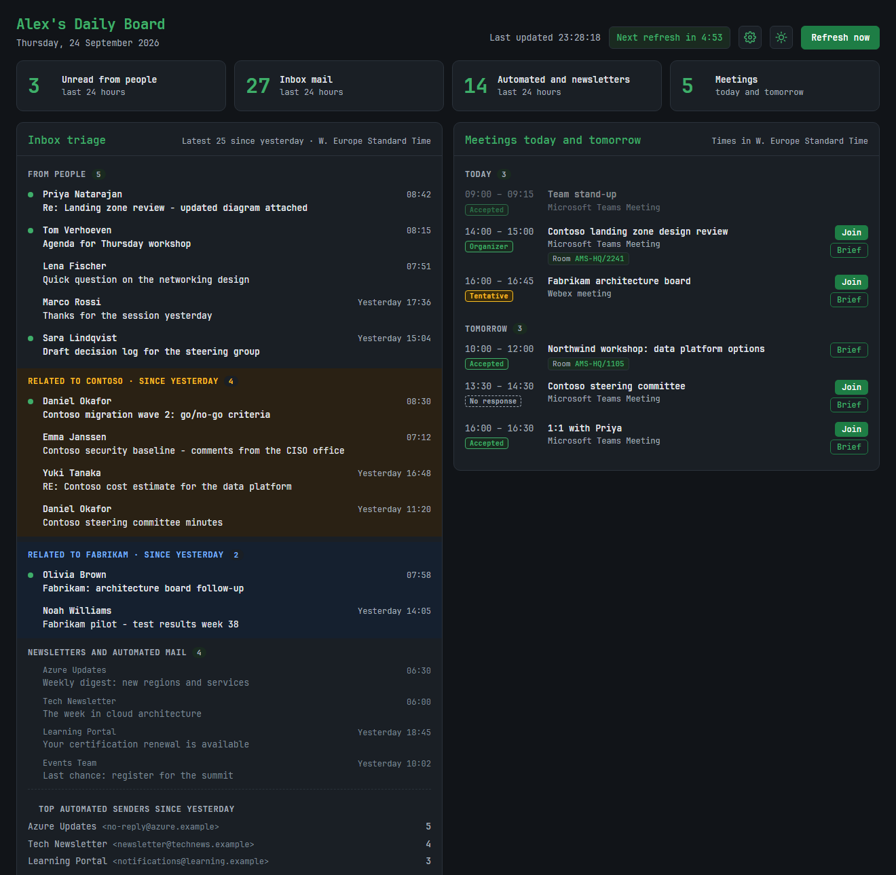
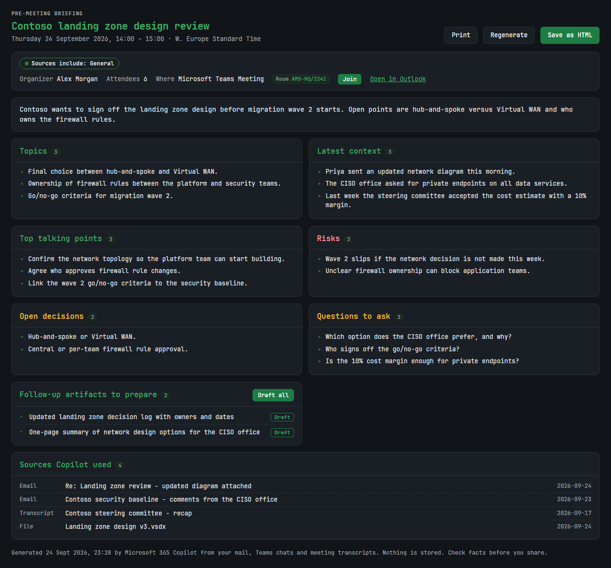
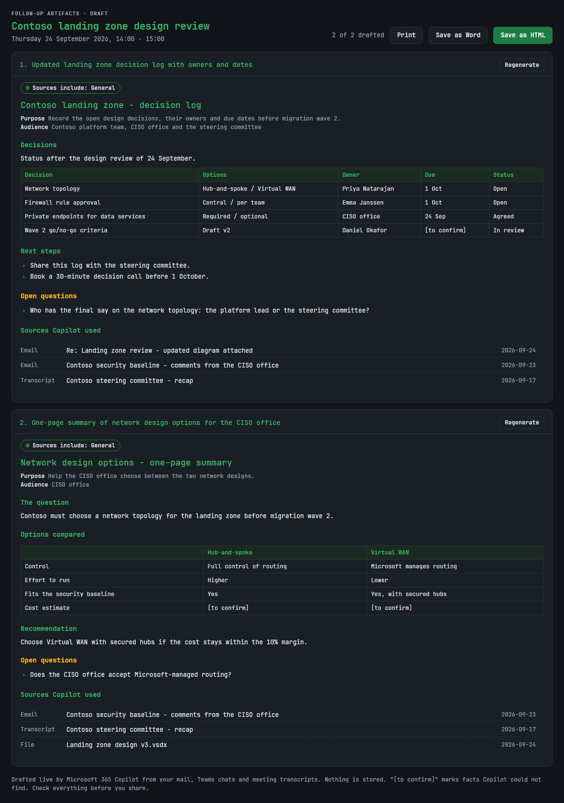
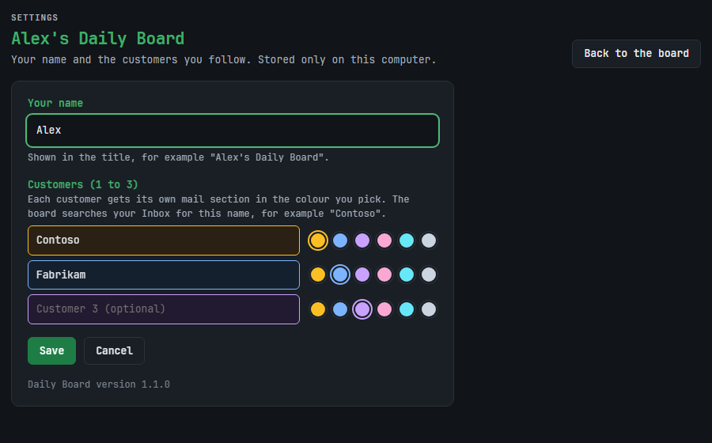
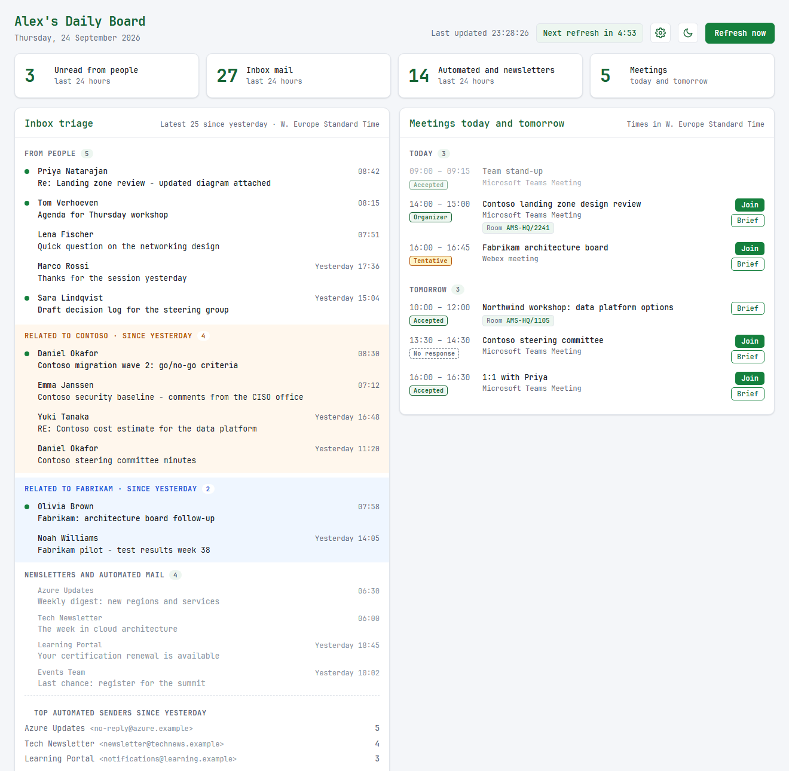
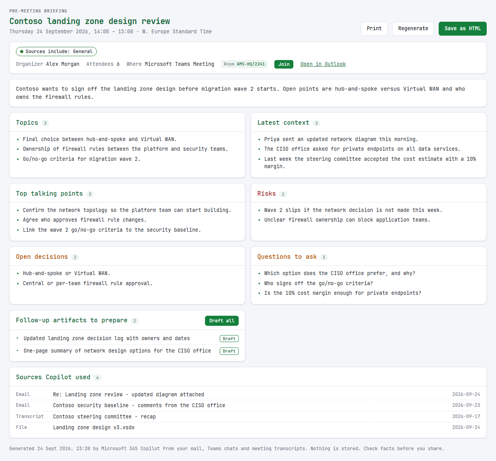
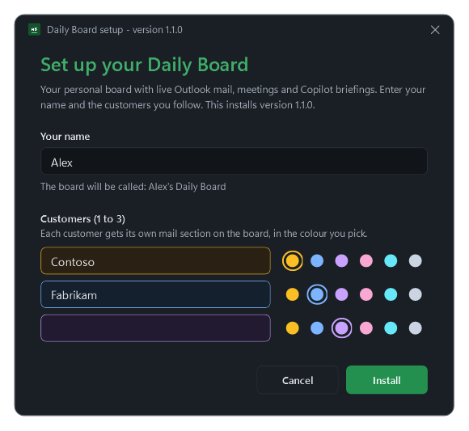

# Daily Board

**Your working day on one screen.** The Daily Board shows the mail that matters, your meetings for today and tomorrow, and it lets Microsoft 365 Copilot prepare you for each meeting. It runs on your own Windows PC and reads Microsoft 365 with your own sign-in. It stores nothing.

**Download:** [DailyBoardSetup-1.1.0.exe](release/DailyBoardSetup-1.1.0.exe) (version 1.1.0, 27 MB, Windows 10 and 11) · [what's new](CHANGELOG.md)



*All screenshots use made-up sample data (Contoso, Fabrikam and invented people).*

---

## What the board does

**Inbox triage**
- Shows the mail you received since yesterday, from people first. A green dot marks unread mail.
- Gives each customer you follow (up to three) its own section, in a colour you pick. The section lists all mail about that customer since yesterday.
- Puts newsletters and automated mail in a quiet grey list, and shows the top automated senders, so you know what to unsubscribe from.
- Opens an email in Outlook on the web when you click its subject.

**Meetings today and tomorrow**
- Shows only real meetings: online meetings (Teams, Webex, Zoom, Google Meet and others) and meetings with a room. It leaves out all-day items, out-of-office blocks, declined meetings and focus time.
- Shows your response (Accepted, Organizer, Tentative, No response), the room, a **Join** button and a **Brief** button.

**Pre-meeting briefing**
- **Brief** asks Microsoft 365 Copilot to read your mail, Teams chats, meeting transcripts and files about that meeting. After about a minute you get a one-page briefing: summary, topics, latest context, talking points, risks, open decisions, questions to ask, follow-up artifacts to prepare, and the sources Copilot used.
- Shows the strongest sensitivity label of the sources, for example "Confidential".

**Follow-up drafts**
- **Draft** (or **Draft all**) asks Copilot to write the follow-up artifacts from the briefing, such as a decision log or a one-page summary, grounded in your own data. Copilot writes "[to confirm]" where it cannot find a fact.
- Save the drafts as Word or HTML, or print them.

**Always**
- Refreshes itself every 5 minutes.
- Light and dark mode.
- Reads everything live with your own Microsoft 365 sign-in. It stores no mail, meetings, briefings or drafts. The only things it stores are your name, customers and colours, on your own PC.

## The buttons at the top of the board

| Button | What it does |
|---|---|
| **Last updated** and **Next refresh in 4:53** | When the board last read your mail and calendar, and when it reads them again. The countdown turns amber in the last 10 seconds. |
| **Gear** | Opens **Settings**. There you change your name (the board's title), your customers (1 to 3) and the colour of each customer section. **Save** stores the settings on this PC and takes you back to the board; **Cancel** changes nothing. The same checks apply as in the setup: a name, at least one customer, no duplicate names and a different colour per customer. |
| **Sun or moon** | Switches between light and dark mode. Without a choice, the board follows your Windows setting. |
| **Refresh now** | Reads your mail and calendar again right away. |

## Screenshots

**A pre-meeting briefing**, made by Microsoft 365 Copilot after you press **Brief** on a meeting.



**Follow-up drafts** of the artifacts in the briefing, after you press **Draft all**.



**Settings** (the gear button): your name, your customers and their colours.



### Light mode

The board and the briefing in light mode. Each customer keeps its colour (here Contoso in amber and Fabrikam in blue).





---

## Installation

### Prerequisites

The board reads your data through **[Microsoft Work IQ](https://learn.microsoft.com/microsoft-365/copilot/extensibility/work-iq/cli)**: Microsoft's connection that gives an app access to your mail, calendar, Teams chats, meeting transcripts and files, and to Microsoft 365 Copilot. Briefings and drafts are written by Microsoft 365 Copilot through Work IQ.

**For you**
- A Windows 10 or 11 PC. Normal (x64) and ARM PCs both work. You do not need administrator rights.
- A Microsoft 365 work or school account in an organisation where Work IQ is set up (see below).

**For your IT team (once per organisation)**
- **Admin consent for the Work IQ app** in Microsoft Entra. An administrator approves the app "Work IQ" (application ID `ba081686-5d24-4bc6-a0d6-d034ecffed87`) for the organisation. See the [Work IQ administrator guide](https://github.com/microsoft/work-iq/blob/main/ADMIN-INSTRUCTIONS.md).
- **Usage-based billing with Copilot Credits.** Work IQ is billed per use. An administrator sets up a billing plan in Copilot Studio with an Azure subscription and assigns the users. See [usage-based billing for Copilot Credits](https://learn.microsoft.com/microsoft-365/copilot/usage-based-billing-overview-copilot-credits). Every briefing and draft uses Copilot Credits; reading mail and the calendar uses very few.

**Not needed**
- No GitHub Copilot, Copilot Cowork, Node.js or other AI product. The board brings its own engine.
- The board does not work with Claude, ChatGPT or another AI: it has no AI of its own and always uses Microsoft 365 Copilot through Work IQ.

If sign-in says that your account has not allowed the connector, admin consent or the billing assignment is missing. Ask your IT team.

### Install
1. Download [DailyBoardSetup-1.1.0.exe](release/DailyBoardSetup-1.1.0.exe).
2. Double-click it. The setup is not signed yet, so Windows can show "Windows protected your PC". Click **More info**, then **Run anyway**.
3. Enter your name and 1 to 3 customers, and pick a colour for each customer. Click **Install**.

   

4. Click **Start the board**. The board opens in your browser.
5. Click **Sign in**, and sign in with your Microsoft 365 work account.

A shortcut "*Your name*'s Daily Board" is now on your desktop and in the Start menu. The board stops by itself after 30 minutes without use. Open it again with the shortcut.

### Check the download (optional)
The SHA-256 checksum of each release is in [release/SHA256SUMS.txt](release/SHA256SUMS.txt). Compare it in PowerShell:

```powershell
Get-FileHash .\DailyBoardSetup-1.1.0.exe -Algorithm SHA256
```

### Change your name or customers
Click the gear button on the board. Or run the setup again: it shows your current details.

### Update
Run the setup of the new version. It shows which version you have and which version it installs. It keeps your settings. If the update fails, your previous version comes back.

### Remove
Windows **Settings → Apps → Installed apps → Daily Board → Uninstall**. This removes the board, its shortcuts and your settings. Your mail and calendar are not affected.

### Silent install (for IT)
```
DailyBoardSetup-1.1.0.exe /Q /C:"setup.cmd -Quiet -UserName Alex -Customers Contoso,Fabrikam -Colors amber,blue"
```

- Colours are optional: amber, blue, violet, pink, cyan, slate.
- Exit code 0 means installed. Exit code 2 means the setup stopped; the reason is in `%TEMP%\DailyBoardSetup.log`. The setup checks the input with the same rules as the setup window and never installs different settings.
- For customer names with spaces, extract first with `DailyBoardSetup-1.1.0.exe /Q /T:C:\Temp\DailyBoard /C`, then run `powershell -ExecutionPolicy Bypass -File C:\Temp\DailyBoard\install.ps1 -Quiet -UserName Alex -Customers "Contoso,Fabrikam Ltd"`.

---

## Privacy and security in short
- The board runs only on your PC (address 127.0.0.1) and accepts requests only from its own pages.
- Sign-in uses the standard Microsoft sign-in (OAuth with PKCE). The sign-in token stays in memory only; you sign in again after the board restarts.
- Copilot gets the meeting details as data only, never as instructions. Source links are clickable only when they match Copilot's own reference list.
- The setup package contains no personal or customer data. The build checks this before every release.

---

## For developers

### Folders
- `app/` — the board: a Node.js server without dependencies, and the web pages.
- `installer/` — setup (`install.ps1`), uninstaller (`uninstall.ps1`), their shared modern window (`ui.ps1`, WPF, follows Windows light/dark) and the launcher script.
- `build.ps1` — builds the setup file.
- `release/` — released setup files and their checksums.
- `docs/` — README screenshots, and `docs/demo/demo-server.js`, which serves the board with sample data.
- `daily-dashboard-full-prompt.md` — the full specification of the whole solution.
- `VERSION` and `CHANGELOG.md` — the version number and what changed.

### Build
1. Put the Node.js LTS Windows x64 build in `runtime-src\node-<version>-win-x64\` (download from nodejs.org). The build checks its version, its official SHA-256 and its OpenJS Foundation signature. When you move to a new Node.js version, update the three pinned values at the top of `build.ps1`.
2. Run `.\build.ps1` in Windows PowerShell. The result is `dist\DailyBoardSetup.exe`.

The build packages only an approved list of app files. It runs a privacy check first and stops if the package would contain e-mail addresses, user folders, your Windows user name, or the name and customers from your own board settings.

### Release a new version
1. Change the number in `VERSION` (MAJOR.MINOR.PATCH).
2. Add a section to `CHANGELOG.md`.
3. Run `.\build.ps1 -Release`. It puts `DailyBoardSetup-<version>.exe` in `release\` and adds its checksum to `release\SHA256SUMS.txt`.
4. Update the download links in this README, and remove the setup file of the previous version from `release\`.

The board, the Settings page, the setup window and Windows Settings → Apps all show the number from `VERSION`.

### Refresh the screenshots
Run `node docs\demo\demo-server.js` and open http://127.0.0.1:12900/. The demo server shows the real pages with sample data only. It needs no sign-in and never touches Microsoft 365.